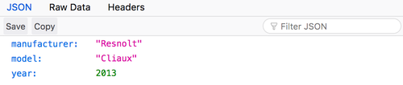

Web 服务在 HTTP 协议存在的时候就已经存在了。但是，特别是当云计算问世以来，它们已成为让客户与我们的数据进行交互的一种非常普遍的方式。

当在使用 SOAP API 的时候，我还没有足够幸运地成为一名开发者。因此，我对 **REST** 比较了解，这是一种用于构建 API 的基于资源的体系结构风格。

**我一直在从事涉及构建或使用 API 的项目**，已经一两年了。

我见过的大多数 API 都声称是 **RESTful** ——即符合 REST 体系结构的原则和约束。

然而，**他们中的一些人一直给 REST 带来非常、非常坏的名声。**

<iframe src="//player.bilibili.com/player.html?aid=44368211&bvid=BV1zb411h7GM&cid=77689275&page=1" scrolling="no" border="0" frameborder="no" framespacing="0" allowfullscreen="true"> </iframe>

错误的使用状态码，纯文本的响应，模式（schemas）不一致……**这些我都见过**（或者说至少见过很多）。所以我决定写一些我认为在设计 REST API 时的一些好的实践。

## 免责声明

我没有权力说下面的做法 100% 符合神圣的 RESTful 原则（如果有的话！）。我从构建和使用各种 API 的经验中收集了这些信息。

同样，我也不假装已经掌握了 REST API 设计！这是一门**手艺**——你练习得越多，就做得越好。

我将公开一些代码片段作为「糟糕设计的例子」。如果它们看起来和你写的东西很像，那也没关系！唯一重要的是我们一起学习。我希望这篇简单的清单体文章能够帮助我们做到这一点。

接下来：**这里有一些技巧、建议和建议来设计让你的用户开心的 REST API。**

## 了解适用于 REST 的 HTTP 的基础知识

如果你要构建一个设计良好的 **REST API**，那么最好了解 **HTTP 协议的基础知识**。我坚信**这将帮助你做出更好的设计决策**。

我发现 MDN Web 文档上的 [HTTP 概览](https://developer.mozilla.org/en-US/docs/Web/HTTP/Overview)是一个非常好的阅读材料。然而这太长了，这里列出一个 HTTP 应用于 REST 的基础知识摘要：

- HTTP 有**动词**（或者说是请求方法）最常见的有：GET，POST，PUT，PATCH和DELETE。
- REST 是**面向资源**的，资源由 **URI** 表示：`/newspapers/`。
- 一个**端点**（endpoints）是一个动词和一个 URI 的组合，例如：`GET: /articles/`。
- 一个端点可以解释为一个**资源上的操作**，例如：`POST: /articles/` 可能意味着「创建一篇新文章」。
- 在高层次，**动词映射到 CRUD 操作**：`GET` 代表`读取`，`POST` 代表`创建`，`PUT` 和 `PATCH` 代表`更新`，`DELETE` 代表……emm，`删除`。
- 相应的状态由其**状态码**指定：`1xx` 用于信息，`2xx` 用于成功，`3xx` 用于重定向，`4xx` 用于客户端错误，`5xx` 用于服务端错误。

当然，你可以可使用 HTTP 协议为 REST API 设计提供任何内容，但是我相信这些是基本注意事项。

## 不要返回纯文本

大多数 REST APIs 都使用 JSON 作为数据格式，尽管它不是由 REST 风格强加的。

但是返回包含 JSON 格式字符串的主体（body）是不够的。你需要**指定 `Content-Type` 头**！它的值必须设置为 **`application/json`**。

这对于一些**编程客户端**（例如，某人或某服务通过 Python 中的 `requests` 库来与你的 API 进行交互）来说尤其重要——它们中的一些依赖于这个头来正确解码相应。

**重要提示**：你可以用 Firefox 很容易的验证一个响应（reponse）的 `Content-Type`。它为响应内置了 `Content-Type: application/json` 的漂亮提示。🔥

<!--  -->


<!--  -->

<!--  -->


<!--  -->

## 避免在 URI 中使用动词

如果你已经了解了基础知识，那么你现在就会知道在 URI 中加入动词是**不 RESTful** 的。

这是因为 **HTTP 的请求方法应该足以描述在资源上执行的操作**。

假如你希望提供一个端点来生成和检索文章的 Banner，我会加上 `:param` 一个 URI 参数的占位符（例如 ID 或者 slug）。你可以会尝试着这么写：

```console
GET: /articles/:slug/generateBanner/
```

但是这里 `GET` 方式在语义上已经足够说明我们正在检索（"GETting"）一个 Banner。那么，让我们使用：

```console
GET: /articles/:slug/banner/
```

类似的，对于创建新文章的端点：

```console
# 不要这样
POST: /articles/createNewArticle/
# 应该这样
POST: /articles/
```

HTTP 请求方法就是一切！

## 使用复数名词

对于资源名词，你可能很难决定应该使用复数还是单数形式。

你应该用 `/article/:id/` （单数）还是 `/articles/:id/` （复数）？

**我建议使用复数形式。**

为什么？因为它能更好的匹配所有类型的端点。

我同意 `GET /article/2/` 很好，但是 `GET /article/` 怎么样？我们得到的是系统中唯一的条目，还是全部？

为了避免这种模棱两可，让我们保持一致，在任何地方都使用复数：

```console
GET: /articles/2/
POST: /articles/
...
```

## 在响应体中返回错误详细信息

当 API 服务器处理错误时，在 JSON 正文中返回**错误详细信息**来帮助用户调试是很方便的（也是推荐的!）如果你包含了哪些字段受到了错误的影响，那么将获得特别的荣誉！

```json
{
  "error": "Invalid payoad.",
  "detail": {
    "surname": "This field is required."
  }
}
```

## 注意状态码

这一点非常重要，如果你在这篇文章只能记住一件事，那就可能是这个：

> 你的 API 可能做的最糟糕的事情是返回一个错误响应 `200 OK` 状态代码。

这只是糟糕的做法。应该**返回有意义的状态代码**，以正确的描述错误的类型。

当然，你可能会想：「但是，我正在按照你给的建议在响应正文中发送错误的详细信息，那么这有什么问题呢？」

让我给你讲个故事。

我曾经不得不使用一个 API，每一个响应都返回 `200 OK`，表明是否请求成功是通过一个 `status` 字段：

```json
{
  "status": "success",
  "data": {}
}
```

因此，即使状态为200 OK，我也不能绝对确定它不会失败。

实际上，这个 API 还会返回如下响应：

```http
HTTP/1.1 200 OK
Content-Type: text/html

{
    "status": "failure",
    "data": {
        "error": "Expected at least two items in list."
    }
}
```

（是的——它还返回 HTML 内容，为什么不呢？）

因此，在我读取 `data` 之前，我必须检查状态码和特别的 `status` 字段，以完全确保一切正常。

**这种设计是绝对不能的，因为它破坏了API和用户之间的信任。** 开始担心API可能在欺骗你。

这一切都是 _非常_ un-RESTful 的。那么你应该怎么做呢？

**使用状态代码，只使用响应体提供错误详细信息。**

```http
HTTP/1.1 400 Bad Request
Content-Type: application/json

{
    "error": "Expected at least two items in list."
}
```

## 一致使用状态码

一旦你掌握了状态码，你就应该努力一致地使用它们。

例如，如果你选择 `POST` 端点返回某个地方创建的 `201 Created`，那么对每个 `POST` 端点使用相同的状态码。

为什么？因为用户不必担心哪个端点上的 _which方法会在哪个环境中返回哪个状态码_。

因此，请保持**一致**，如果你偏离约定，请在有明显标志的地方进行**记录**。

通常，我坚持以下几点：

```console
GET: 200 OK
POST: 201 Created
PUT: 200 OK
PATCH: 200 OK
DELETE: 204 No Content
```

## 不要嵌套资源

REST API 处理资源，并且检索资源的列表或单个实例很简单。但是，当你处理**相关资源**时会发生什么？

假设我们想要检索特定作者的文章列表——具有 `id = 12` 的作者。基本上有两种选择。

第一种方法是将 `articles` 资源**嵌套**在 `authors` 资源下，例如:

```console
GET: /authors/12/articles/
```

有些人推荐它，因为它确实代表了作者与其文章之间的一对多关系。

然而，**现在已经不清楚**你在请求什么类型的资源了。这是作者吗？这篇文章吗？

同样，[扁平比嵌套更好](https://www.python.org/dev/peps/pep-0020/#id3)，因此必须有更好的方法……而且确实有！

我的建议是**使用 querystring** 直接过滤 `articles`资源：

```console
GET: /articles/?author_id=12
```

这显然意味着：「获取作者#12的所有文章」，不是吗？👍

## 优雅地处理拖尾斜杠

URI 是否应该在后面加上 `/` 并不是一个真正的争论。简单地选择一种方法或另一种方法（即：带或不带尾斜杠），并且**在用户错误使用的时候，优雅的进行重定向**。

（我得说，我自己也犯过不止一次这样的错误。🙈）

又到了故事时间！有一天，当我将 REST API 集成到项目中时，每次调用我都收到了 `500 Internal Error`。我使用的端点看起来长这个样子：

```console
POST: /entities
```

我很生气，不知道自己做错了什么。

最后，事实证明**服务出了问题，因为我缺少了一个结尾斜杠！**所以我开始使用：

```console
POST: /entities/
```

在此之后，一切都很正常。🤦‍♂️

该 API 尚未修复这个问题，但是希望你可以为用户防止这种类型的问题。

**温馨提示**：大多数 Web 框架都有一个选项来重定向到URL的尾随或未尾随版本，找到那个选项并激活它。

## 使用 querystring 进行过滤和分页

很多时候，一个简单的端点不足以满足复杂的业务逻辑。

你的用户可能希望检索满足特定条件的选项，或者一次检索少量的选项以提高性能。

这正是**过滤**和**分页**的目的。

使用**过滤**，用户可以指定返回的项目应该具有的属性。

**分页**允许用户检索数据集的一部分。最简单的分页就是**页码分页**，它由 `page` 和 `page_size` 决定。

现在的问题是：如何将这些功能集成到 `RESTful API` 中？

我的答案是：**使用 querystring**。

我想说，使用 querystring 进行分页的原因是非常明显的。它是这样的：

```console
GET: /articles/?page=1&page_size=10
```

但对于过滤来说，它可能不那么明显。刚开始，你可能会考虑这样做，只检索已发表文章的列表：

```console
GET: /articles/published/
```

设计问题：**published 不是资源**！相反，它是你正在检索的数据的特征。这种事情应该放在 **querystring** 中。

因此最后，用户可以检索「包含 20 篇的已发布文章的第二页」，如下所示：

```console
GET: /articles/?published=true&page=2&page_size=20
```

很漂亮，不是吗？

## 学习 `401 Unauthorized` 和 `403 Forbidden` 之间的区别

在处理 API 中的安全性错误时，很容易混淆该错误是与**authentication**还是**authorization**（也称为permissions）有关——我经常遇到这种情况。

下面是我的备忘单，让你知道根据情况我该如何应对：

- 用户是否未提供身份验证凭据？他们无效吗？👉 `401 Unauthorized`。
- 用户是否已正确验证身份，但没有访问资源所需的权限？👉 `403 Forbidden`。

## 充分利用 `202 Accepted`

我发现 `202 Accepted` 被用来代替 `201 Created` 是非常方便的。它的意思是：

> 我，服务器，已经理解了你的请求。我还没有创建资源，但这很好（指这不是一个错误）。

我认为 `202 Accepted` 特别适用于以下两种情况：

- 资源是否会用于将来的处理而创建——例如，在一个工作完成后。
- 如果资源已经以某种方式存在，但是不应将其解释为错误。

## 使用专门用于 REST API 的 web 框架

作为最后一个最佳实践，我们将讨论这个问题：**你如何实际在 API 中实现最佳实践？**

通常，你想创建一个快速的 API，以便一些服务可以相互交互。

Python 开发人员将使用 Flask，JS 开发人员将使用 Express，他们将实现一些简单的路由来处理 HTTP 请求。

这种选择的问题在于，**通常而言，该框架并非针对构建 REST API 服务**。

例如，Flask 和 Express 都是两个非常通用的框架，但是它们并不是*专门*用来帮助你构建 REST API 的。

因此，你必须采取**额外的步骤**在你的 API 中实现最佳实践。大多数时候，「懒惰」或「缺乏时间」意味着你不会付出努力，从而留给你的用户一个古怪的 API。

解决方案很简单：**使用合适的工具**。


各种语言中出现了专门用于构建 REST API 的新框架。**他们帮助你遵循最佳实现，不会很麻烦，也不牺牲生产力。**

在 Python 中，我发现的最好的 API 框架之一是 [Falcon](https://falconframework.org)。它与 Flask 一样简单易用，非常快，并且非常适合在几分钟内构建 REST API。

<!--  -->


<!--  -->

如果你使用的是 Django，那么转到 [Django REST Framework](http://www.django-rest-framework.org) 即可。它不是那么直观，但是功能强大。

在 NodeJS 中，尽管我尚未尝试过 [Restify](http://restify.com)，但它似乎也是一个不错的选择。

我强烈建议你尝试一下这些框架！它们将帮助你构建美观，优雅且设计良好的 REST API。

## 让我们给 REST 一个好名声

我们都应该努力使 API 成为一种使用乐趣。希望本文能够帮助你学习一些技巧和技术，以构建**更好的 REST API**。对我而言，它归结为**良好的语义**，**简单性**和常识。

REST API 设计是一门手艺。如果你对以上几点有不同的看法，我很乐意听听。

在此期间，请持续提供优质的API！💻

---

原文地址：[RESTful API Design: 13 Best Practices to Make Your Users Happy](https://florimond.dev/blog/articles/2018/08/restful-api-design-13-best-practices-to-make-your-users-happy/), by Florimond Manca
