[What is this thing](https://www.reddit.com/r/whatisthisthing/) 是 reddit 上的一个社区（community），上面时不时会有人发一些没见过的玩意来提问。

一起来看看吧！

<!-- more -->

### 跳绳

> Q: Jump Rope Spike? Two spring covered spikes connected with paracord

带钉子的跳绳？两个带有钉子的弹性握把被伞绳连接在了一起。

<!-- 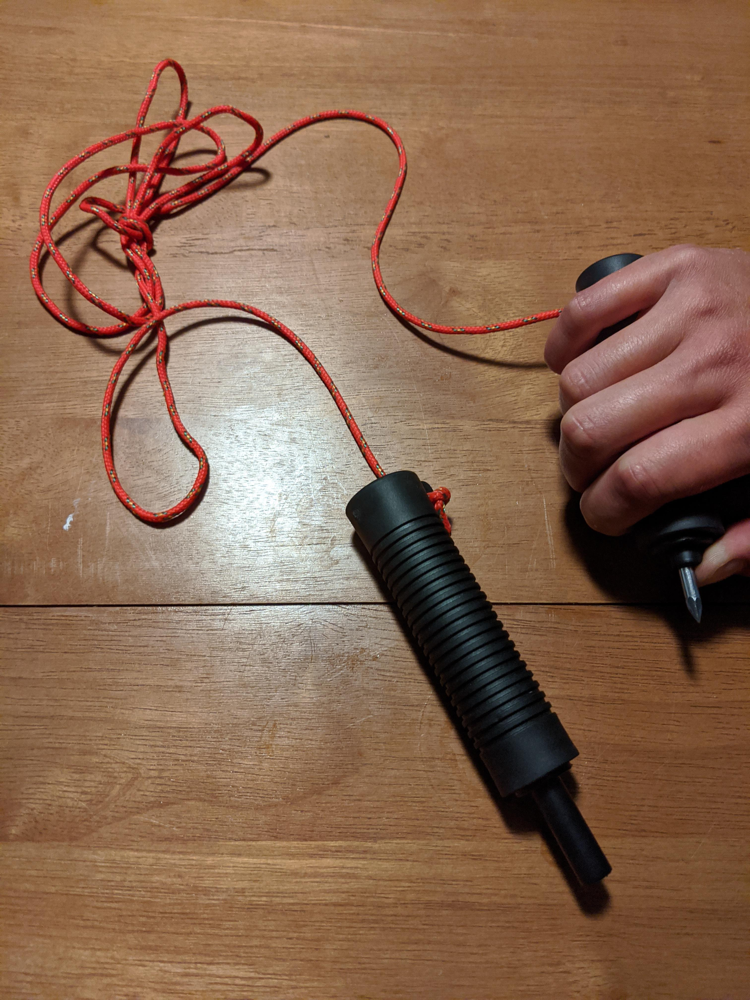 -->



> A: They are rescue grips for things like ice fishing. Run the cord through your jacket sleeves and the spikesv are at hand if you fall through the ice.

这是用于类似冰钓的时候的救援物。将绳子穿过夹克的袖子，这样当你落水时，钉子就在你触手可及的地方。

[https://www.reddit.com/r/whatisthisthing/comments/itl1j2/jump_rope_spike_two_spring_covered_spikes/](https://www.reddit.com/r/whatisthisthing/comments/itl1j2/jump_rope_spike_two_spring_covered_spikes/)

### 狗牌

> Q: WITT My dad passed away early Monday morning and my siblings and I are in the process of cleaning out his things from his room. We found these items in a jewelry box with his US Air Force dog tag from Vietnam. Quite obviously they’re pins, but I’m looking for some help identifying them- if they are from his service and if not, what they might be from. He didn’t much like to talk about his time in the military.

这是什么？我爸爸在星期一清晨去世了，我和我的兄弟姐妹们在清理他房间里的东西，我们在一个装有他越南的美国空军狗牌的首饰盒里发现了这些东西，很明显这些是别针。我们在寻找能够帮我们鉴别它们的信息，如果它们是他服役期间的，如果不是的话，那这些又是什么呢？他不太愿意谈论他在军队时候的日子。

<!-- 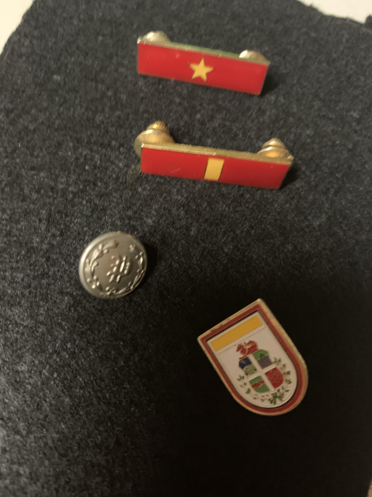 -->



> A: Top 2 are pins of the PAVN of a major general rank and a corporal. Third pin too blurry. 4th pin dont know. Top 2 pins are obviously "war souvenirs".

前两枚是少将和下士的徽章，第三枚太模糊了，第四枚没清楚。前两枚徽章显然是「战争纪念品」。

[https://www.reddit.com/r/whatisthisthing/comments/ir4snh/my_dad_passed_on_monday_and_in_the_process_of/](https://www.reddit.com/r/whatisthisthing/comments/ir4snh/my_dad_passed_on_monday_and_in_the_process_of/)

### 肩章

> Q: Buddy bought a shop, the shop had a military uniform in the attic. Appears WWII era. What does this patch mean?

朋友盘了家商店，商店的阁楼上发现了这件军装，出现在二战时期，这个标志是什么意思？

<!-- 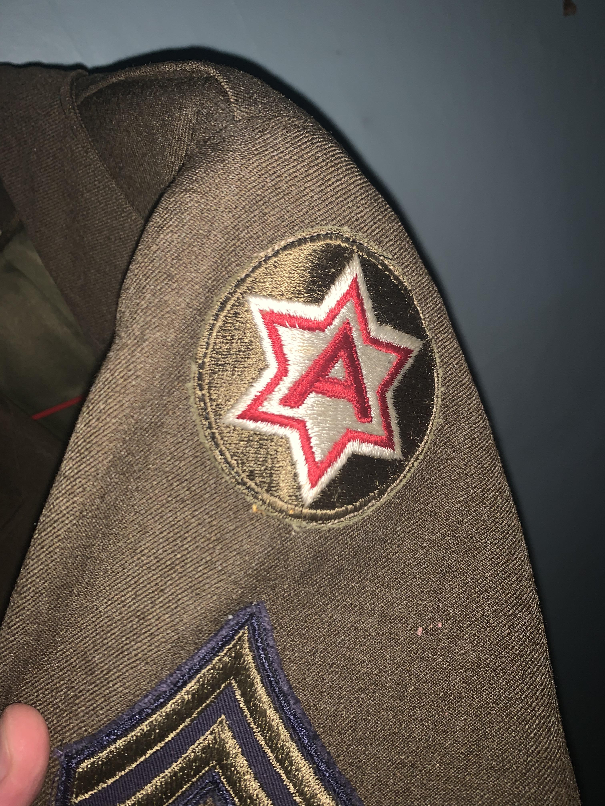 -->



> A: The six pointed star is significant of the number “six” and the red letter “A” signifies “Army.” The red and white colors are the colors of the design approved for distinguishing flags for the numbered Armies. The shoulder sleeve insignia was originally approved for the Sixth Army on 26 January 1927. The original design was cancelled and a new design approved on 10 January 1945. It was amended to change the background color from olive drab to Army Green on 6 December 1960. [From here:](http://www.milbadges.com/corps/USA/field)

美国第六陆军，肩袖徽章。

六个尖角代表数字六，红色的A代表军队（Army）。红色和白色是批准用于区分编号的陆军旗帜的设计颜色。

最初在1927年1月26日第六军批准了肩袖徽章。原来的设计被取消，新的设计于1945年1月10日获得批准。1960年12月6日，修改后的背景色由橄榄色改为军绿色。

<!-- 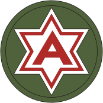 -->



[https://www.reddit.com/r/whatisthisthing/comments/irtrnq/buddy_bought_a_shop_the_shop_had_a_military/](https://www.reddit.com/r/whatisthisthing/comments/irtrnq/buddy_bought_a_shop_the_shop_had_a_military/)

### 洞

> Q: Built into the side of a small hill in SE Pennsylvania. Doorway is about 4-5' high. This road used to be well traveled before cars came along. Very close to a creek.

建在宾夕法尼亚州东南部一座小山上。门口大约有4-5英尺高。这条路在汽车出现之前行人就很多了。离小溪很近。

<!-- 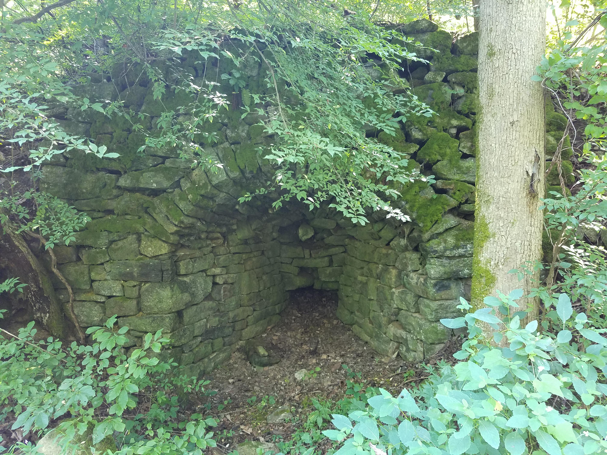 -->



> A: kind'a resembles old historic lime kilns

有几分像有着古老历史的石灰窑。

[https://www.reddit.com/r/whatisthisthing/comments/irid2p/built_into_the_side_of_a_small_hill_in_se/](https://www.reddit.com/r/whatisthisthing/comments/irid2p/built_into_the_side_of_a_small_hill_in_se/)

### 艺术品

> Q: I found this glass type thing while digging in my yard. It was about 2 feet deep in the dirt, as in the first picture, and it is 16.5 pounds or 7.5kg.

 我在院子里挖东西的时候发现了这个玻璃样的东西。就和第一张照片一样，它被埋在泥土中大约有2英尺深，重16.5磅(7.5公斤)。

 <!-- 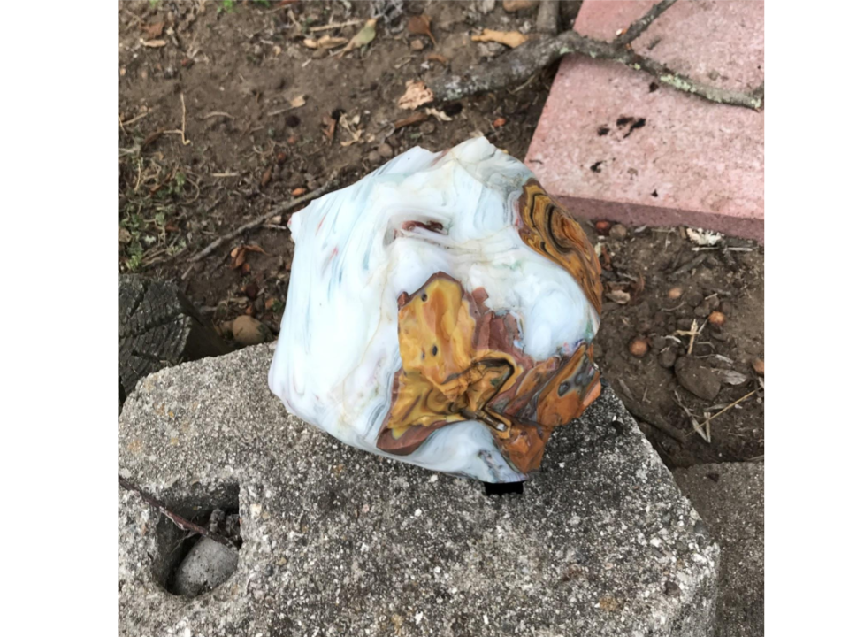 -->

 <!-- 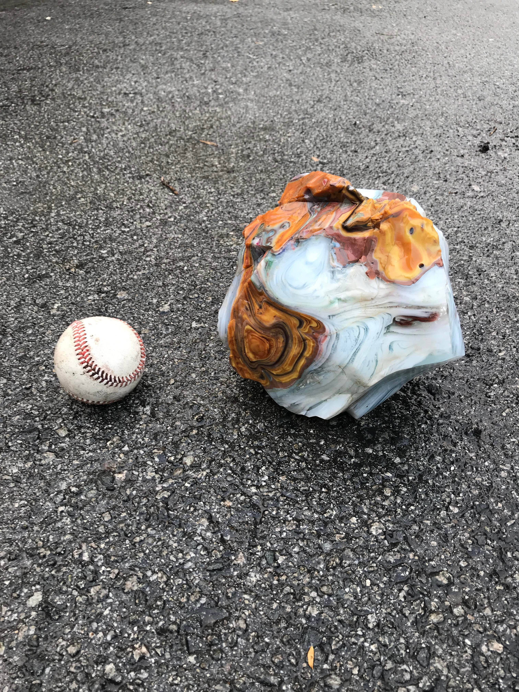 -->

 <!-- 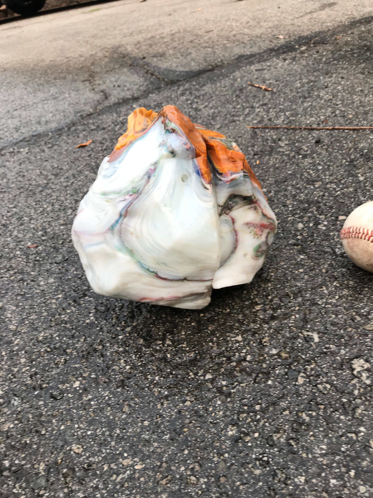 -->

 <!-- 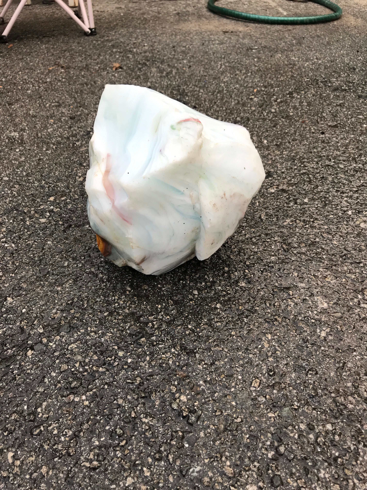 -->

 

 

 

 

 > A: Looks like [slag glass](https://www.google.com/search?q=white+slag+glass+chunks&safe=active&rlz=1CAPPDO_enUS786US786&sxsrf=ALeKk02rK8k0TcJIDPGZVwPSi-BkUJCKaQ:1600028469435&source=lnms&tbm=isch&sa=X&ved=2ahUKEwjb6bPE-ubrAhWids0KHQDXCywQ_AUoAnoECA0QBA&biw=1318&bih=665). It may have been used for decoration.

 看起来像炉渣玻璃，它可能被用来装饰。

 > A: Popular in the art nouveau and Craftsman styles and again in the '50s.

在新艺术和工匠风格中流行，在50年代再次流行。

[https://www.reddit.com/r/whatisthisthing/comments/is5nux/i_found_this_glass_type_thing_while_digging_in_my/](https://www.reddit.com/r/whatisthisthing/comments/is5nux/i_found_this_glass_type_thing_while_digging_in_my/)

### 绝对是古董

> Q: Found while cleaning up my parents estate, never seen anything like it before. It’s rusted and definitely antique

在清理父母的财产时发现的，之前从未见过类似的东西。生锈了，绝对是古董。

<!-- 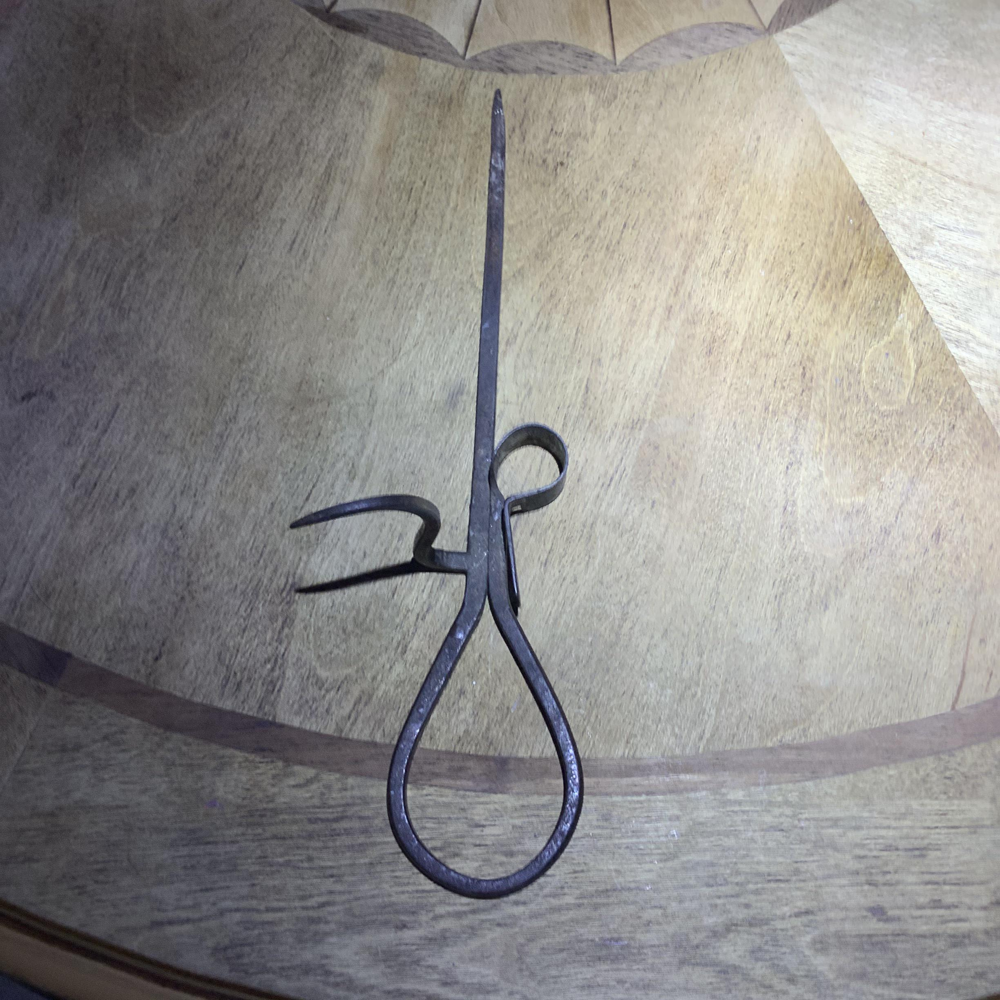 -->



> A: I think that's a [miner's candle holder](https://www.google.com/search?q=miner%27s+candle+holder&safe=active&rlz=1CAPPDO_enUS786US786&sxsrf=ALeKk03M6eSF7tFqPtzsxrUYRzmgcOtKbQ:1599781113489&source=lnms&tbm=isch&sa=X&ved=2ahUKEwjQlPOH4d_rAhWWHM0KHQpCAZAQ_AUoAnoECA4QBA&biw=1318&bih=665). It would have been stuck into a timber. It's called a sticking tommy

我觉得这是个矿工用的烛台，它被卡在木头中。它叫做 sticking tommy（不知道咋翻译了）

注：去找了下它的使用办法，直接看图：

<!-- 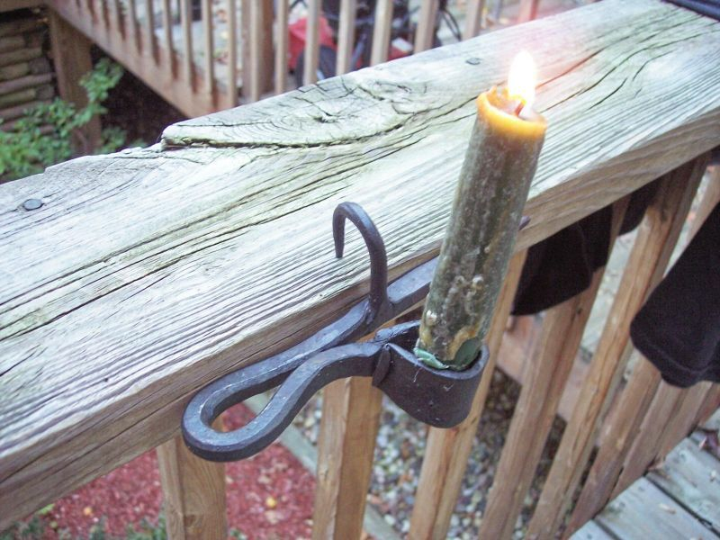 -->

<!-- 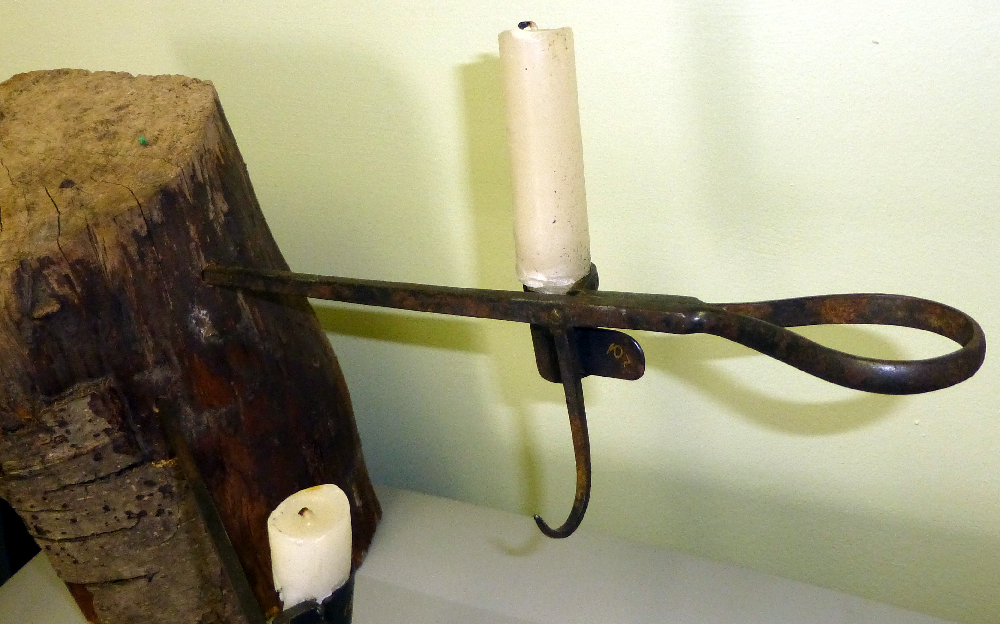 -->





[https://www.reddit.com/r/whatisthisthing/comments/iqetl8/found_while_cleaning_up_my_parents_estate_never/](https://www.reddit.com/r/whatisthisthing/comments/iqetl8/found_while_cleaning_up_my_parents_estate_never/)

### 一战

> Q: WWI-era army tool found in a bag of rifle and pistol rounds

在一袋步枪和手枪子弹中发现的一战时期的军用工具

<!-- 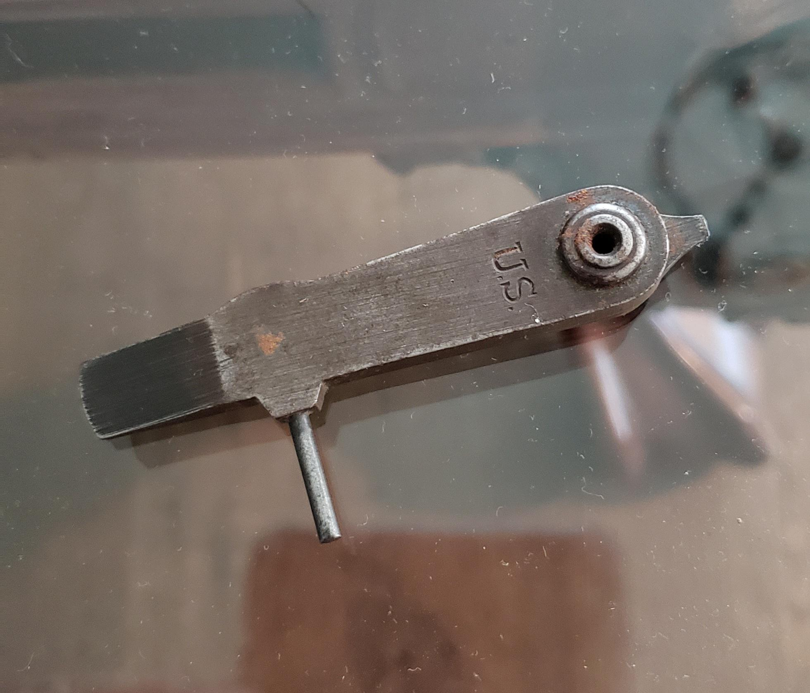 -->



> A: This is a tool used to tear down the rifle for maintenance and cleaning. It can also help adjust the sights of the rifle.

这是一种用来拆卸步枪进行维护和清洁的工具。它还可以帮助调整步枪的瞄准器。

[https://www.reddit.com/r/whatisthisthing/comments/iqsnqx/wwiera_army_tool_found_in_a_bag_of_rifle_and/](https://www.reddit.com/r/whatisthisthing/comments/iqsnqx/wwiera_army_tool_found_in_a_bag_of_rifle_and/)
