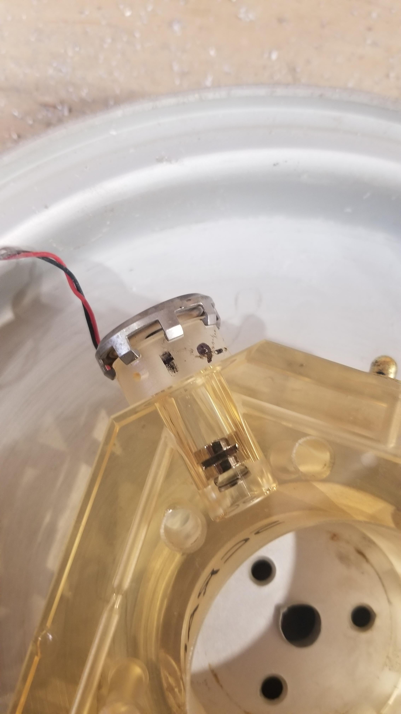

[What is this thing](https://www.reddit.com/r/whatisthisthing/) 是 reddit 上的一个社区（community），上面时不时会有人发一些没见过的玩意来提问。

一起来看看吧！

<!-- more -->

### 砚

> Q: Does anyone know what this box is?

有谁知道这个盒子是什么吗？

<!--  -->

<!--  -->

<!--  -->







> A: Chinese or Japanese ink, in block form. You use the dish, with a little water, to grind it into a usable liquid. [https://www.bitsandpiecesuk.co.uk/product/sumi-e-ink-set](https://www.bitsandpiecesuk.co.uk/product/sumi-e-ink-set)

中国或日本的墨。成块状的，你可以用少许水将碟子研磨成可用的液体。

[https://www.reddit.com/r/whatisthisthing/comments/ki8bsy/does_anyone_know_what_this_box_is/](https://www.reddit.com/r/whatisthisthing/comments/ki8bsy/does_anyone_know_what_this_box_is/)

### 奇怪编号顺序的板子

> Q: Found in a storage cupboard at work. The black bits come out. The number order is ... weird?

在工作的储藏室里发现的，上面有黑色的小块，编号顺序看起来也好奇怪。

<!--  -->



> A: It almost looks like sales samples for plastic parts that might be button actuators or something. The numbers might be the model/part numbers. I know this has nothing to do with rail controls.

它看起来就像塑料部件的销售样品，可能是按钮驱动器之类的。

编号可能是型号/零件号。我知道这和铁路控制无关。

[https://www.reddit.com/r/whatisthisthing/comments/k20dox/found_in_a_storage_cupboard_at_work_the_black/](https://www.reddit.com/r/whatisthisthing/comments/k20dox/found_in_a_storage_cupboard_at_work_the_black/)

### 鸡头？

> Q: What is this hoof looking thing? Very light and feels rubbery. Found on farmland in Central Victoria, Australia.

这个长得像蹄子的东西是什么?很轻，摸起来有橡胶的感觉。发现于澳大利亚维多利亚州中部的农田。

<!--  -->

<!--  -->

<!--  -->

<!--  -->









> A: I shoe horses for a living. I use a pour in pad that sets up and sort of looks like that. It is made to provide some cushion for a horses foot. When it comes off it looks a lot like that. You can see the edge around it. That is where some of the material was under a horse shoe.

我以给马钉蹄铁为生。我用了一个像这样的倒料垫。它是用来给马蹄提供垫子的。当它脱落的时候，看起来很像这样。

你可以看到它周围的边缘。这是马蹄铁下的一些材料。

[https://www.reddit.com/r/whatisthisthing/comments/k6j55u/what_is_this_hoof_looking_thing_very_light_and/](https://www.reddit.com/r/whatisthisthing/comments/k6j55u/what_is_this_hoof_looking_thing_very_light_and/)

### 水槽

> Q: This device in a nursing home that appears to be halfway between a sink and a toilet

这个装置位于疗养院的水槽和马桶之间。

<!--  -->



> A: Clinical sink, it’s for dumping bedpans.

临床水槽，用于倾倒便盆。

[https://www.reddit.com/r/whatisthisthing/comments/k3jms6/this_device_in_a_nursing_home_that_appears_to_be/](https://www.reddit.com/r/whatisthisthing/comments/k3jms6/this_device_in_a_nursing_home_that_appears_to_be/)

### 迷你手榴弹？

> Q: This solid metal thing threaded through this hollow wooden cylinder

这个坚固的金属穿过了这个空心的木圆柱体。

<!--  -->

<!--  -->

<!--  -->







> A: Bird call.

鸟哨。

（译者注：这个翻译可能不太准确，因为它不是用来吹的。叫「鸟叫发生器」可能会好一点。）

<iframe src="//player.bilibili.com/player.html?aid=415795337&bvid=BV18V411b7iY&cid=271173362&page=1" scrolling="no" border="0" frameborder="no" framespacing="0" allowfullscreen="true"> </iframe>

[https://www.reddit.com/r/whatisthisthing/comments/k7q03a/this_solid_metal_thing_threaded_through_this/](https://www.reddit.com/r/whatisthisthing/comments/k7q03a/this_solid_metal_thing_threaded_through_this/)

### 五粮液

> Q: Weird stuff found in an old jewelry

在一个旧珠宝里发现了一些奇怪的东西。

<!--  -->

<!--  -->

<!--  -->







> A: The art technique is called Cloisonne. The bottles could be snuff bottles sold as souvenirs.

这种工艺叫做景泰蓝。这些鼻烟壶可以作为纪念品出售。

[https://www.reddit.com/r/whatisthisthing/comments/kcip09/weird_stuff_found_in_an_old_jewelry_info_first/](https://www.reddit.com/r/whatisthisthing/comments/kcip09/weird_stuff_found_in_an_old_jewelry_info_first/)

### 缆绳桶

> Q: What is this weird large barrel looking thing hanging on a wire at local park?

这个挂在当地公园电线上的奇怪的大桶是什么？

<!--  -->

<!--  -->

<!--  -->







> A: It is for fire hose competition. Move the barrel back and forth with fire hoses.

这是消防水带比赛用的。用消防水管来回移动水桶。

[https://www.reddit.com/r/whatisthisthing/comments/kilt8q/what_is_this_weird_large_barrel_looking_thing/](https://www.reddit.com/r/whatisthisthing/comments/kilt8q/what_is_this_weird_large_barrel_looking_thing/)

### 工具

> Q: This was found with old tools. Doesn't seem to attach to anything. It can lock in place and the middle bit turns round, unravelling two straps of fabric. I'm stumped!

这是在旧工具中找到的。似乎没有依附于任何东西。它可以锁定到位，中间的钻头转动，解开两束织物。我被难倒了！

<!--  -->

<!--  -->

<!--  -->

<!--  -->









> A: It’s for carrying books.

它是用来拿书的。

<!--  -->



> Q: Solved! Thank you. I've been thinking about this for MONTHS and you found it in minutes haha. Thank you again! (even though I'm slightly embarrassed!)

解决了!谢谢你！我想了好几个月了，你几分钟就找到了，哈哈。再一次感谢您！（尽管我有点尴尬！）

<!--  -->

<!--  -->





[https://www.reddit.com/r/whatisthisthing/comments/kbpauf/this_was_found_with_old_tools_doesnt_seem_to/](https://www.reddit.com/r/whatisthisthing/comments/kbpauf/this_was_found_with_old_tools_doesnt_seem_to/)

### 不知道

> Q: Silver drum/disks, 1 in 40 had this inside, the rest were empty

银色桶/碟子里面发现的，每 40 个里面就有一个这个，其余都是空的。

<!--  -->

<!--  -->

<!--  -->

<!--  -->









> A: It looks a lot like the optical element of a ring laser gyroscope. [https://en.wikipedia.org/wiki/Ring_laser_gyroscope](https://en.wikipedia.org/wiki/Ring_laser_gyroscope) Take a look at the first picture on Wikipedia. And here are some optical elements by themself: [https://www.alibaba.com/product-detail/50-Optics-Cavity-Of-Laser-Gyro_60784225297.html](https://www.alibaba.com/product-detail/50-Optics-Cavity-Of-Laser-Gyro_60784225297.html)

它看起来很像环形激光陀螺仪的光学元件。

[https://en.wikipedia.org/wiki/Ring_laser_gyroscope](https://en.wikipedia.org/wiki/Ring_laser_gyroscope)

看看维基百科上的第一张照片。

<!--  -->



这里是一些光学元件本身:

[https://www.alibaba.com/product-detail/50-Optics-Cavity-Of-Laser-Gyro_60784225297.html](https://www.alibaba.com/product-detail/50-Optics-Cavity-Of-Laser-Gyro_60784225297.html)

[https://www.reddit.com/r/whatisthisthing/comments/kdsytm/silver_drumdisks_1_in_40_had_this_inside_the_rest/](https://www.reddit.com/r/whatisthisthing/comments/kdsytm/silver_drumdisks_1_in_40_had_this_inside_the_rest/)

### 指尖陀螺

> Q: Solid brass.. and every pin on the outside unscrews. The center hole is threaded and around 3/4" - 1" in diameter.

黄铜做的，外部的每一个大头针都能打开，内部的圆直径大概四分之三英寸到一英寸之间。

<!--  -->



> A: It was a fidget-spinner but the bearings are gone

原本是个指尖陀螺，但是中间的轴承不见了。

[https://www.reddit.com/r/whatisthisthing/comments/k6yzte/solid_brass_and_every_pin_on_the_outside_unscrews/](https://www.reddit.com/r/whatisthisthing/comments/k6yzte/solid_brass_and_every_pin_on_the_outside_unscrews/)
