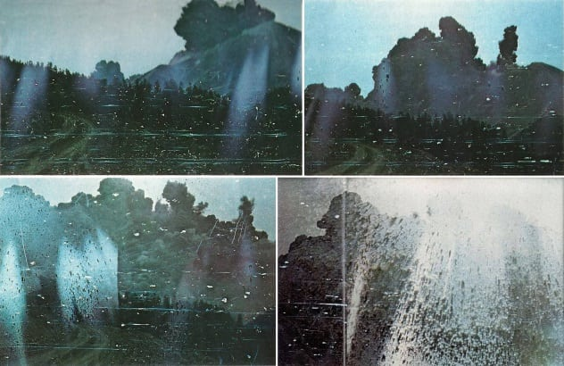
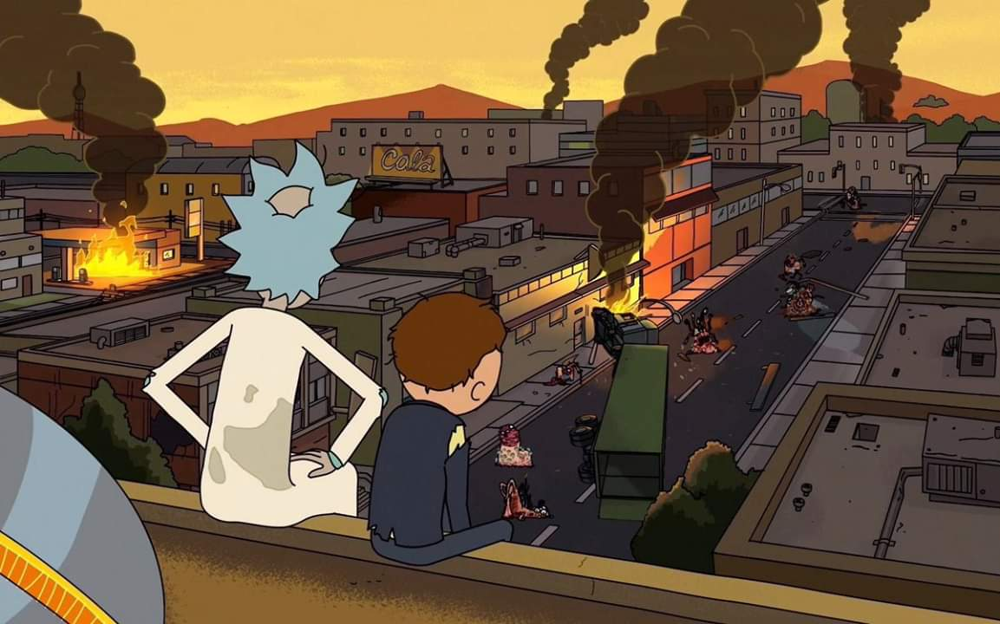
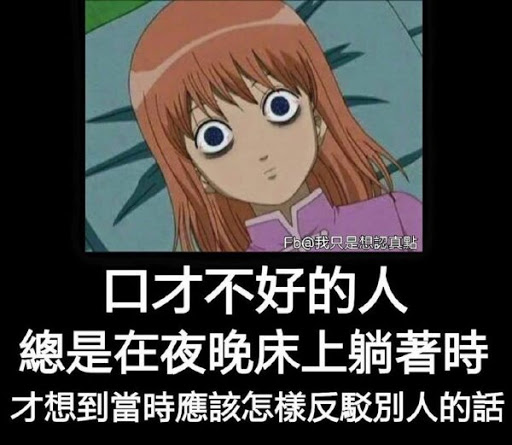

关于我什么呢，我也不知道，放一些一直以来收集的骚话吧！

*   Let's show them who we are.

*   

*   纸上得来终觉浅，绝知此事要躬行。

*   

*   [为什么看见你弟兄眼中有刺，却不想自己眼中有梁木呢？](https://cnbible.com/matthew/7-3.htm)

*   路上没有灯火的时候，就点亮自己的头颅。

    

*   有一只小鸭子在排队，想和前面的鸭鸭对齐，可是怎么样都对不齐，它就嘀咕着说：「对不齐鸭对不齐鸭。」

*   >   [Embrace, extend, and extinguish.](https://en.wikipedia.org/wiki/Embrace,_extend,_and_extinguish)

    [拥抱，扩展再消灭。](https://zh.wikipedia.org/wiki/%E6%8B%A5%E6%8A%B1%E3%80%81%E6%89%A9%E5%B1%95%E5%86%8D%E6%B6%88%E7%81%AD)

*   [海記憶體知己，天涯若比鄰。](https://www.v2ex.com/t/653386#reply7)

*   World is powered by solitude.

*   Do have faith in what you're doing.

*   >   [人の命は、2万分の1でも8万分の1でもない。そうじゃなくて、そこには「1人が死んだ事件が2万件あった」ってことなんだよ。](https://bedtimepoem.com/?p=12276)

    人的性命（死亡）不该说是2万分之一，或8万分之一，它的意思是，有一个人死了这件事，发生了2万次。

*   你从小到大做了无数个大大小小的选择，都不能阻止你看到这句话。

*   >   [So if people are sufficiently worried, then there\'s a lot less to worry about. But if no one is worried, that\'s when you should worry!](https://www.bilibili.com/video/av95917816?t=506)

    所以说：如果人们都足够担心的话，那你就没什么可担心的；但如果没有人担心的话，那你就得好好担心一下了。

*   [人的每一分钟都在变化，所以也要接受别人有变化。如果那个人跟你一日为友，就终身为友，你应该心里很紧张才对。就是：「怎么啦，我们两个都从此不变化了嘛？」所以如果有了变化，然后人际关系也跟着有了变化，他是你某一阶段最好的朋友，然后他当完了他该当的朋友，他就去当别人的朋友了。就接受人生的变化，是最好的态度。](https://www.bilibili.com/video/av80845403)

*   [计算机的所有东西都是人做出来的，别人能想得出来的，我也一定能想得出来。在计算机里头，没有任何黑魔法。所有的东西，只不过是我现在不知道而已，总有一天，我会把所有的细节、所有的内部的东西全都搞明白的！](https://www.bilibili.com/video/av15267247?p=82&t=44)

*   [骄傲在败坏以先，狂心在跌倒之前。](https://cnbible.com/proverbs/16-18.htm)

*   所有的离别，都是我在练习失去你。

    

*   [已是悬崖百丈冰，犹有花枝俏。](https://baike.baidu.com/item/%E5%8D%9C%E7%AE%97%E5%AD%90%C2%B7%E5%92%8F%E6%A2%85/124232)

*   Teaching sand to think was a mistake.

    

*   [一个健康的社会不应该只有一种声音。](https://weibo.com/1663937380/Is0UJchJW)

*   警察只是按要求训诫，主播只是按稿子播报，后台只是按上面意思删帖撤热搜。大家都认为自己是好人，一切是生活所迫。只有当每一个人都敢说“我拒绝撒谎”，“我拒绝执行”的时候，我们才不会在某一天求助无门，走投无路，像狗一样地死去。但你敢吗。你不敢。所以请记得，无论这个世界最终烂成什么样子，都是在我们的默许之下完成的。

    

*   [那熔铸眼前世界的炉火，他们早已经忘记了。](https://www.bilibili.com/video/av77327621?t=140)

*   Everything will be fine in the end, Morty, And if it isn&apos;t, it&apos;s not the end yet.

    

*   [「轻奢」这个词造得可谓精妙绝伦，是一种市场细分后的修辞手法。比如 100 块的衣服叫「屌丝」，1000 块的叫「奢侈品」，500 块的命名就很讲究了。不能叫「重屌」，而要叫「轻奢」，给人一种我在向社会上层流动的幻觉。](https://www.bilibili.com/video/av83908288#reply2270052215)

*   >   [She was still too young to know that life never gives anything for nothing, and that a price is always exacted for what fate bestows.](https://book.douban.com/subject/1051524/)

    她那时候还太年轻，不知道所有命运馈赠的礼物，早已在暗中标好了价格。

*   我们不能随便生气。生气的时候，你会使出真本领。这样，别人就会知道你的真本领很烂。

*   便宜的东西只有一个优点：就是便宜。

*   贵的东西只有一个缺点：就是贵。

*   人的大脑直到 25 岁才发育完全，然而从 15 岁到 18 岁他们的大脑运用得如何，往往将决定他们的余生。

*   如果你非要等到新年才开始做出改变，说明这个改变对你也不太重要。

*   在现实的人类社会中，除非有更大的光明将它改变，否则永远存在着两种人，一个在天上，一个在地下，一个是从善的亚伯，一个是从恶的该隐。

*   很抱歉啊，我白天都没什么机会和你说话，只能憋到晚上给你发句晚安。但你可别小看了这两个字，它可包含着我今天清晨见到的阳光，中午看到的白云，傍晚遇见的微风，包含着我这一天每句想对你说的话。晚安。

*   我的眼睛很大很大，装得下高山，装得下大海，装得下蓝天，装得下整个世界；我的眼睛很小很小，有时遇到心事，就连两行泪，也装不下。

    

*   最痛苦的是什么呢？你恰巧有一点天赋，够你去觊觎天才们那片殿堂，却不够你进入。你在门前徘徊，却敲不开那扇门。你颓然而坐，却隐隐约约听到殿堂内传来一声叹息：「我好菜啊」。

*   其实，你觉得能觊觎也是错觉，你只是能大概理解对一些科学理论的通俗解释。

*   [我见着日落时，她也见着日落，虽相隔千里，但对于太阳来说我和她在一起。](https://weibo.com/2377356574/Ii8XQ8zjg)

*   我们不能吹嘘自己设置的独特密码，真是太可惜了。

*   前路虽长，尤可期许。

*   每当成年人想要改变生活、逆转状态时，会不约而同做一件事：（再次开始）学英语。

    

*   [卑鄙是卑鄙者的通行证，高尚是高尚者的墓志铭。](https://zh.wikipedia.org/wiki/%E6%9C%A6%E8%83%A7%E8%AF%97#%E5%8C%97%E5%B2%9B)

*   我也不知道喜欢你什么，只是你不在的时候就会想你，想到你的每一个分钟我都会变得开心，这就是我最单纯的想法。如果只是单纯喜欢你的某一点的话，那就是有条件的喜欢而已，假使有一天那个条件突然发生了改变，那我对你得喜欢是不是应该就会变？所以我喜欢的不是你的某个什么，而是你的一切和每个和你在一起的瞬间。

*   我告诉你我喜欢你，并不是一定要和你在一起，只是希望今后的你，在遭遇人生低谷的时候，不要灰心，至少曾经有人被你的魅力所吸引，曾经是，以后也会是。

*   我永远喜欢你，不是说我会十年二十年一辈子都喜欢你，而是指，我这一刻喜欢你的程度，让我有勇气说出来我永远喜欢你。

*   [我把我的青春给你，不是因为想换取和你的婚礼。](https://www.musixmatch.com/lyrics/%E5%A5%BD%E6%A8%82%E5%9C%98-2/%E6%88%91%E6%8A%8A%E6%88%91%E7%9A%84%E9%9D%92%E6%98%A5%E7%BB%99%E4%BD%A0)

*   但愿我能给你带来快乐，同时，又反射到我身上。

*   你无法控制其他人的脾气，但你可以保持一颗冷静的头脑。

    

*   没有你在床真的没什么好赖的。

*   茫茫人海我们能相遇，缘分占百分之十，我长得好看占百分之九十。

*   [Love is a touch and yet not a touch.](https://en.wikipedia.org/wiki/The_Heart_of_a_Broken_Story)

*   [不要前行！前面是无边的森林：古老的树现着野兽身上的斑纹，半生半死的藤蟒一样交缠着，密叶里漏不下一颗星星。你将怯怯地不敢放下第二步，当你听见了第一步空寥的回声。](https://baike.baidu.com/item/%E9%A2%84%E8%A8%80/2915721)

*   事实上，机场比婚礼现场见证了更多真挚的接吻，医院的墙壁比教堂聆听了更多的祷告。

*   >   [Night gathers, and now my watch begins. It shall not end until my death. I shall take no wife, hold no lands, father no children. I shall wear no crowns and win no glory. I shall live and die at my post. I am the sword in the darkness. I am the watcher on the walls. I am the fire that burns against the cold, the light that brings the dawn, the horn that wakes the sleepers, the shield that guards the realms of men. I pledge my life and honor to the Night&apos;s Watch, for this night and all the nights to come.](https://www.youtube.com/watch?v=_3BhOWpurdc)

    长夜将至，我从今开始守望，至死方休。我将不娶妻、不封地、不生子。我将不戴宝冠，不争荣宠。我将尽忠职守，生死於斯。我是黑暗中的利剑，长城上的守卫。我是抵御寒冷的烈焰，破晓时分的光线，唤醒眠者的号角，守护王国的坚盾。我将生命与荣耀献给守夜人，今夜如此，夜夜皆然。

*   年轻有年轻的代价。

*   [如果天总也不亮，那就摸黑过生活；如果发出声音是危险的，那就保持沉默；如果自觉无力发光，那就别去照亮别人。但是——但是：不要习惯了黑暗就为黑暗辩护；不要为自己的苟且而得意洋洋；不要嘲讽那些比自己更勇敢、更有热量的人们。可以卑微如尘土，不可扭曲如蛆虫。](https://weibo.com/1428546035/ymeph0NuH)

*   智商不如人没什么可耻的。只是要承认这一点有点困难。

*   [路虽弥，不行不至。](https://zh.wikisource.org/zh/%E8%8D%80%E5%AD%90/%E4%BF%AE%E8%BA%AB%E7%AF%87)

*   道阻且长，行则将至。

*   你一直兼容，用户就一直觉得没问题，用户就会一直用，用户一直用，你就要一直兼容。

*   普通人负责普通就行了。

*   碎片化时间，听起来像一种能撕裂时空的超能力。

*   觉得自己能力不足无法战胜黑暗怎么办？

*   [没有实力到只能去靠诚意表真心。](https://www.zhihu.com/question/21905681/answer/92992501)

*   目所能及又岂能是全部呢？

*   怕什么真理无穷，进一寸有进一寸的欢喜。

    

*   梦境和死亡，都无定所，无处可去，终将被遗忘，我们身在此处，但没有人会记得，万物皆逝，仅剩夜晚，再见。

    

*   口才不好的人，总是在夜晚床上躺着时，才想到当时应该怎样反驳别人的话。

    

*   遇到喜欢的东西，就把它买下来。钱并不是真的花掉了，只是换一种方式，陪伴在你的身边。

    

*   我不看星星，也不说想你。这样星星和你都蒙在鼓里。

    
